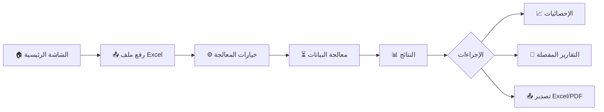

<div align="center">

# 🎯 نظام تحسين قص السجاد (CutOptimizer Desktop)

<p align="center">
  
</p>

**النظام البرمجي الاحترافي لتحسين عمليات القص وتقليل الهادر في صناعة السجاد**

[](https://www.python.org)
[](https://doc.qt.io/qtforpython/)
[](https://pandas.pydata.org)
[](LICENSE)

[العربية](#) | [English](#english-version)

---

</div>

## 📖 نظرة عامة

**نظام CutOptimizer** هو تطبيق مكتبي متقدم مصمم خصيصاً لمصانع وورش السجاد والأقمشة لتحسين عمليات القص وتقليل الهادر (الضائع) إلى أدنى مستوى ممكن. يستخدم التطبيق خوارزميات ذكية لترتيب قطع السجاد على النول (الماكينة) بأفضل طريقة، مما يوفر الوقت، المال، والموارد.

### 🎯 المشكلة التي يحلها

في صناعة السجاد، يتم إنتاج القطع على ماكينات بعرض محدد (مثل 400 سم). عندما تأتي طلبات العملاء بأحجام مختلفة، يصبح التخطيط اليدوي لكيفية توزيع هذه القطع على عرض الماكينة:

- 🕐 **مستهلكاً للوقت**: يتطلب ساعات من الحسابات اليدوية.
- 📉 **غير فعال**: يؤدي لهدر كبير في المواد لعدم القدرة على ملء العرض بالكامل.
- ⚠️ **عرضة للأخطاء**: أخطاء في تجميع الأطوال تؤدي لقصات خاطئة وخسائر مادية.

**الحل:** نظام CutOptimizer يقوم بأتمتة هذه العملية بالكامل باستخدام خوارزميات التحسين الذكية التي تجد أفضل توليفة ممكنة في ثوانٍ معدودة.

---

## ✨ المميزات الرئيسية

### 🧮 تحسين القص الذكي (Smart Optimization)
- **خوارزميات متقدمة**: تجميع القطع بناءً على العرض المتاح للماكينة (Min/Max Width).
- **نظام الاقتراحات الذكي**: اقتراح مجموعات بديلة للقطع الصغيرة التي لم تجد مكاناً في المعالجة الرئيسية.
- **مراعاة هوامش القص (Tolerance)**: إمكانية تحديد تفاوت مسموح به في الأطوال لزيادة كفاءة التجميع.
- **تكرار ذكي (Multi-Repeat)**: تكرار نفس التجميعة الناجحة عدة مرات لتقليل عدد مرات ضبط الماكينة.

### 📊 إدخال وإدارة البيانات
- **استيراد من Excel**: دعم رفع ملفات Excel تحتوي على الطلبيات مباشرة.
- **معاينة حية**: عرض تفاصيل الملف المرفوع (عدد الأسطر، الأعمدة، البيانات) قبل البدء.
- **التحقق التلقائي**: فحص البيانات المدخلة والتأكد من توافقها مع معايير النظام.

### � تقارير شاملة ودقيقة
- **تصدير Excel متطور**: 
  - صفحات تفصيلية لكل مجموعة قص مع تلوين مميز لكل قطعة.
  - صفحة ملخص للإدارة (إجمالي الأمتار، المساحة، الكفاءة).
  - صفحة المتبقي (القطع التي لم يتم قصها مع الأسباب).
  - نظام التدقيق (Audit) لضمان دقة الكميات.
- **تقرير PDF**: توليد تقارير مبسطة وجاهزة للطباعة لعمال القص.

### ⚙️ إعدادات مرنة
- **إدارة مقاسات الماكينات**: حفظ واسترجاع مقاسات ماكينات متعددة (400 سم، 500 سم، إلخ).
- **تخصيص المظهر**: 
  - تصميم **Glassmorphism** حديث وجذاب.
  - دعم الوضع الداكن والفاتح (Dark/Light Mode).
  - إمكانية تغيير خلفيات التطبيق.
- **وحدات القياس**: دعم القياس بالسنتيمتر والمتر.

---

## 🛠️ البنية التقنية

### التقنيات المستخدمة
| التقنية | الاستخدام |
| :--- | :--- |
| **Python 3.8+** | لغة البرمجة الأساسية |
| **PySide6** | إطار عمل الواجهة الرسومية (Qt) |
| **Pandas** | معالجة وتحليل البيانات الضخمة |
| **XlsxWriter** | إنشاء وتنسيق ملفات Excel الاحترافية |
| **FPDF2** | توليد تقارير PDF |

### هيكل المشروع
```text
lib/
├── core/               # المحرك الرئيسي والخوارزميات
│   ├── Enums/          # أنواع البيانات والفرز
│   ├── workers/        # المعالجة في الخلفية (Threading)
│   └── algorithm/      # خوارزمية التجميع والاقتراحات
├── data_io/            # نظام الإدخال والإخراج (Excel/PDF)
├── ui/                 # واجهة المستخدم (Views/Widgets)
├── models/             # نماذج البيانات (Carpet, Group)
└── config/             # الإعدادات والأيقونات
```

---

## 🏗️ هندسة بناء المشروع (System Architecture)

تم تصميم **CutOptimizer** باتباع بنية برمجية مفصلة (Modular Architecture) تضمن الفصل التام بين منطق الحسابات وواجهة المستخدم، مما يحقق الفوائد التالية:

### 1️⃣ الفصل بين المهام (Separation of Concerns)
- **الموديلات (Models):** في مجلد [models](file:///c:/Users/RYZEN/Desktop/Task/CutOptimizer/models)، نعرّف "الأشياء" (مثل السجادة والمجموعة). هذا يجعل الكود مفهوماً جداً؛ فالسجادة ليست مجرد أرقام، بل كائن له خصائص (عرض، طول) ووظائف (استهلاك الكمية).
- **الواجهة (UI):** في مجلد [ui](file:///c:/Users/RYZEN/Desktop/Task/CutOptimizer/ui)، ينصب التركيز فقط على الجماليات وتجربة المستخدم، دون أن تعرف الواجهة كيف تُحسب الخوارزمية.

### 2️⃣ طبقة المعالجة الخلفية (Asynchronous Layer)
بفضل استخدام [grouping_worker.py](file:///c:/Users/RYZEN/Desktop/Task/CutOptimizer/core/workers/grouping_worker.py)، يتم فصل "عقل" البرنامج عن "وجهه":
- **الفائدة:** حتى لو كان المشروع ضخماً ويحتوي على آلاف السجادات، ستظل واجهة البرنامج مستجيبة وسلسة، ولن يظهر للمستخدم رسالة "برنامج لا يستجيب" (Not Responding) المزعجة.

### 3️⃣ إدارة البيانات المركزية (Centralized Data IO)
تم عزل عمليات الإكسيل في [data_io](file:///c:/Users/RYZEN/Desktop/Task/CutOptimizer/data_io):
- **الفائدة:** إذا قررنا مستقبلاً تغيير طريقة إخراج التقارير أو إضافة دعم لملفات PDF بشكل مختلف، سنقوم بتعديل ملف واحد فقط دون المساس بالخوارزمية الرئيسية.

### 4️⃣ القابلية للتوسع (Scalability)
بفضل تقسيم الخوارزمية إلى [grouping_algorithm.py](file:///c:/Users/RYZEN/Desktop/Task/CutOptimizer/core/grouping_algorithm.py) وملفات مساعدة في [group_helpers.py](file:///c:/Users/RYZEN/Desktop/Task/CutOptimizer/core/group_helpers.py):
- **الفائدة:** يمكن للمطورين إضافة منطق رياضي جديد أو تحسين الخوارزمية الحالية بسهولة تامة، حيث أن الكود مقسم لوظائف صغيرة (Functions) كل منها يؤدي مهمة محددة جداً.

---

## � لماذا CutOptimizer؟ (المشكلة والحل)

تعد عملية قص السجاد من الرولات الكبيرة تحدياً هندسياً معقداً يُعرف برمجياً بـ **"Cutting Stock Problem"**. 

### 🚩 المشكلات التي نحلها:
- **الهادر الجانبي العالي:** ضياع أمتار كبيرة من السجاد بسبب عدم توافق عرض الطلبيات مع عرض الماكينة.
- **صعوبة التوازن الطولي:** استحالة حساب عدد القطع المختلفة يدوياً لتنتهي جميعها عند نفس الطول لقصها معاً.
- **الوقت والجهد:** استغراق ساعات في التخطيط اليدوي لمشروع واحد، مع احتمالية خطأ بشرية عالية.

### ⚖️ الحل الذي تقدمه الخوارزمية:
تقدم الخوارزمية **تخطيطاً ذكياً (Optimized Layout)** يضمن:
1. **أقصى إشغال للعرض:** ملء عرض الماكينة (مثلاً 400 سم) بنسبة تصل إلى **99%**.
2. **توازن الارتفاعات:** التأكد من أن جميع الأعمدة داخل "مجموعة القص" تنتهي في نفس الوقت تماماً.
3. **تقليل الهادر:** خفض نسبة الهالك بنسبة تصل إلى **15-30%** مقارنة بالتخطيط التقليدي.

---

## 📝 مثال تطبيقي شامل (Detailed Example)

لنفترض أن عرض الماكينة المتوفر هو **400 سم**، ولدينا الطلبيات التالية:
- **الطلبية (أ):** عرض 150 سم، طول 300 سم.
- **الطلبية (ب):** عرض 100 سم، طول 150 سم.
- **الطلبية (ج):** عرض 150 سم، طول 600 سم.

### ⚙️ كيف تفكر الخوارزمية؟
1. **فحص العرض:** (150 + 100 + 150) = **400 سم**. (توافق تام مع عرض الماكينة).
2. **تحليل الأطوال:**
    - الطلبية (ج) هي الأطول (600 سم). ستعتبرها الخوارزمية "المعيار".
    - الطلبية (أ) طولها 300 سم. الخوارزمية تحسب: $600 \div 300 = 2$. (تحتاج قطعتين من أ).
    - الطلبية (ب) طولها 150 سم. الخوارزمية تحسب: $600 \div 150 = 4$. (تحتاج 4 قطع من ب).
3. **النتيجة النهائية (المجموعة):**
    - **العمود الأول:** قطعة واحدة من (ج) بطول 600 سم.
    - **العمود الثاني:** قطعتان من (أ) فوق بعضهما (300 + 300 = 600 سم).
    - **العمود الثالث:** 4 قطع من (ب) فوق بعضها (150 + 150 + 150 + 150 = 600 سم).

**بذلك، نحصل على "بلوك" واحد متساوي الطول (600 سم) وعرضه 400 سم، يتم قصه دفعة واحدة دون ضياع مليمتر واحد من السجاد!**

---

## ⚙️ الأنظمة المساعدة (System Components)

### 1️⃣ دورة المعالجة الخلفية (Background Processing)
يتم تنفيذ جميع العمليات الحسابية الثقيلة في مسار منفصل (`QThread`) عبر ملف [grouping_worker.py](file:///c:/Users/RYZEN/Desktop/Task/CutOptimizer/core/workers/grouping_worker.py) لضمان عدم تجميد واجهة المستخدم:
- **دمج التكرارات**: يقوم النظام تلقائياً بدمج السجاد المتشابه في الأبعاد (العرض والارتفاع) لتبسيط عملية التجميع، مع الاحتفاظ ببيانات كل طلب (ID، العميل) بشكل منفصل.
- **المعالجة المرحلية**: تبدأ من قراءة الملف -> التحقق -> التجميع -> توليد الاقتراحات -> حفظ الملف.
- **نظام الإشارات (Signals)**: يتم تحديث الواجهة واللوجر (Logger) لحظياً عبر إشارات Qt.

### 2️⃣ محرك الاقتراحات الذكي (Suggestion Engine)
في ملف [suggestion_engine.py](file:///c:/Users/RYZEN/Desktop/Task/CutOptimizer/core/suggestion_engine.py)، يقدم النظام ميزة فريدة للتعامل مع السجاد المتبقي (الذي لم يجد مكاناً في التجميع الأساسي):
- **البحث التنازلي (Recursive Range Search)**: يقوم المحرك بتكرار محاولات التجميع على السجاد المتبقي مع تقليل نطاق العرض المطلوب (Min/Max Width) بمقدار 10 سم في كل دورة.
- **الهدف**: العثور على أي "توليفة" ممكنة حتى لو كانت بعرض أصغر من المطلوب أساساً، لتقليل الهالك إلى أدنى حد ممكن.

### 3️⃣ إدارة الإعدادات (Config Management)
يعتمد التطبيق على [config_manager.py](file:///c:/Users/RYZEN/Desktop/Task/CutOptimizer/core/config/config_manager.py) لحفظ تفضيلات المستخدم:
- **التخزين الدائم**: يستخدم `QSettings` لحفظ المسارات، الأطوال الافتراضية، ووضع التجميع المفضل.
- **دعم JSON**: يدعم النظام حفظ كائنات معقدة (Lists/Dicts) داخل الإعدادات عبر التحويل التلقائي لـ JSON.

### 4️⃣ معالجة الأصول وصور الخلفية (Asset & Background Handling)
لضمان عمل التطبيق بسلاسة على أجهزة ويندوز المختلفة دون فقدان الصور أو تعطل المسارات، يتبع النظام منطقاً صارماً في [background_utils.py](file:///c:/Users/RYZEN/Desktop/Task/CutOptimizer/core/utilies/background_utils.py):
- **التخزين المعزول (AppData Isolation)**: لا يعتمد التطبيق على المسار الأصلي للصورة التي يختارها المستخدم (والتي قد تُحذف أو تُنقل). بدلاً من ذلك، يتم إنشاء مجلد خاص بالتطبيق داخل `AppData/Roaming` باستخدام `QStandardPaths`.
- **آلية النسخ والتحصين**: عند اختيار خلفية جديدة، يقوم النظام بـ:
    1. إنشاء مسار ديناميكي يتوافق مع اسم المستخدم الحالي على ويندوز.
    2. مسح الخلفيات القديمة لتوفير المساحة.
    3. نسخ الصورة المختارة فيزيائياً إلى مجلد النظام المحمي.
- **الاستدعاء الذكي**: يتم حفظ المسار الجديد في "سجل النظام" (Registry) عبر `QSettings` لضمان ظهور الخلفية فور تشغيل البرنامج في المرة القادمة.

### 5️⃣ التحقق الصارم من البيانات (Validation Logic)
قبل بدء أي عملية، يمر السجاد عبر ملف [validation.py](file:///c:/Users/RYZEN/Desktop/Task/CutOptimizer/core/validation.py):
- **منع الأخطاء الكارثية**: التحقق من عدم وجود قيم صفرية أو سالبة في الأبعاد أو الكميات.
- **منطق الإعدادات**: التأكد من أن الحد الأدنى للعرض لا يتجاوز الحد الأقصى، وأن التسامح (Tolerance) قيمة موجبة.

---

## 🛠️ دليل التشغيل للمطورين (Developer Setup)

إليك الخطوات التفصيلية لتشغيل المشروع على بيئة التطوير، وكذلك كيفية تحويله إلى ملف تنفيذي مستقل (EXE).

### 1️⃣ تشغيل المشروع للمطورين (Development Setup)

لضمان تشغيل المشروع بشكل صحيح، يفضل استخدام بيئة وهمية (Virtual Environment):

```bash
# 1. إنشاء بيئة وهمية
python -m venv venv

# 2. تفعيل البيئة الوهمية (Windows)
.\venv\Scripts\activate

# 3. تثبيت المكتبات المطلوبة
pip install -r requirements.txt

# 4. تشغيل التطبيق
python main.py
```

### 2️⃣ تحويل التطبيق إلى ملف تنفيذي (Building EXE)

نستخدم مكتبة **PyInstaller** لتحويل كود البايثون إلى ملف EXE يعمل على أي جهاز بنظام Windows دون الحاجة لتثبيت بايثون.

**الأمر الاحترافي للتحويل:**
```bash
pyinstaller --noconfirm --onedir --windowed --name "CutOptimizer" --icon "assets/icon.ico" --add-data "assets;assets" --add-data "ui/themes;ui/themes" main.py
```

**شرح الخيارات المستخدمة:**
- `--onedir`: لإنشاء مجلد يحتوي على الملف التنفيذي مع المكتبات (أسرع في التشغيل من `onefile`).
- `--windowed`: لمنع ظهور نافذة الـ Console السوداء عند تشغيل البرنامج.
- `--icon`: لتحديد أيقونة البرنامج الرسمية.
- `--add-data`: لضمان تضمين المجلدات الضرورية (مثل الصور، الثيمات، والأيقونات) داخل ملف الـ EXE.

### 3️⃣ متطلبات التشغيل (System Requirements)
- **نظام التشغيل:** Windows 10 أو أحدث (64-bit).
- **المعالج:** Dual-core أو أعلى.
- **الذاكرة (RAM):** 4 جيجابايت كحد أدنى.
- **الشاشة:** دقة 1366x768 كحد أدنى لدعم واجهات البرنامج العريضة.

---

## 🧠 المنطق الرياضي العميق (The Mathematical Core)

تعتمد الخوارزمية على حل معادلة **"تساوي النواتج" (Equal Products Solution)** لضمان خروج جميع مسارات القص بنفس الطول النهائي. إليك التفصيل الممل للمنطق الرياضي:

### 1️⃣ صياغة المشكلة (Problem Formulation)
لنفترض أن لدينا مجموعة من السجاد داخل "قصة" واحدة بأطوال مختلفة $a_1, a_2, ..., a_n$. 
الهدف هو إيجاد عدد التكرارات (الكميات) $x_1, x_2, ..., x_n$ لكل نوع بحيث يتحقق الشرط التالي:
$$a_1 \cdot x_1 \approx a_2 \cdot x_2 \approx ... \approx a_n \cdot x_n \approx L$$
حيث $L$ هو الطول الإجمالي للقصة (Target Length).

### 2️⃣ الحل في حالة عدم وجود تسامح (Zero Tolerance)
عندما يكون التسامح (Tolerance) يساوي 0، يجب أن تتطابق الأطوال تماماً. نستخدم هنا مفهوم **المضاعف المشترك الأصغر (LCM)**:
1. **تبسيط الأطوال:** نقسم جميع الأطوال على القاسم المشترك الأكبر (GCD) للحصول على قيم مبسطة $A_1, A_2, ..., A_n$.
2. **حساب الـ LCM:** نجد أصغر طول مشترك $L_{min} = LCM(A_1, A_2, ..., A_n)$.
3. **تحديد أقصى مضاعف ($k_{max}$):** بناءً على الكميات المتوفرة في المخزن ($X_{max}$)، نحسب كم "مرة" يمكننا تكرار هذا الـ LCM دون تجاوز المخزن:
   $$k_{max} = \min \left( \frac{X_{max,i} \cdot A_i}{L_{min}} \right)$$
4. **حساب الكميات النهائية:** $x_i = \frac{L_{min} \cdot k_{max}}{A_i}$.

### 3️⃣ الحل مع وجود تسامح (Tolerance Algorithm)
في حال سمح المستخدم بفرق (مثلاً 5 سم)، تتحول المشكلة من معادلة دقيقة إلى **بحث في نطاق (Range Search)**:
- نعتبر القطعة الأولى هي المرجع ($a_{ref}$).
- نبحث عن أقصى كمية $x_0$ يمكن استهلاكها من القطعة المرجعية.
- لكل قيمة $x_0$ محتملة، نحسب "الطول المستهدف" $Target = a_{ref} \cdot x_0$.
- لكل قطعة أخرى $i$ في المجموعة، نبحث عن كمية $x_i$ تحقق:
  $$|a_i \cdot x_i - Target| \le \Delta$$
  حيث $\Delta$ هو التسامح المسموح به.
- إذا وجدنا مجموعة قيم $x$ تحقق الشرط لجميع القطع، يتم اعتمادها فوراً كأفضل حل حالي.

### 4️⃣ إدارة التعقيد (Complexity Management)
بما أن عدد الاحتمالات لتجميع الشركاء قد يكون ضخماً جداً (Combinatorial Explosion)، تستخدم الخوارزمية تقنيات لتحسين الأداء:
- **Pruning (التقليم):** استبعاد أي مجموعة يتجاوز عرضها الإجمالي عرض الماكينة قبل البدء في حساباتها الرياضية.
- **Iterative Partnering:** البدء بالبحث عن شريك واحد، ثم اثنين، وهكذا حتى الوصول للحد الأقصى (الذي قد يصل لـ 21 شريكاً للقطع الصغيرة)، مما يضمن إيجاد الحل الأبسط والأسرع أولاً.

---

## �️ المواصفات التقنية والمكتبات (Technical Stack)

تم بناء النظام باستخدام أحدث التقنيات لضمان الأداء العالي والتوافقية الواسعة، وإليك تفصيل المكاتب وسبب اختيار كل منها:

### 1️⃣ لغة البرمجة والإطار الرسومي
- **Python 3.10+**: اللغة الأم للنظام لقوتها في معالجة البيانات والرياضيات.
- **PySide6 (Qt for Python)**: 
    - **السبب:** اختيار واجهات Qt يوفر أداءً "Native" وسرعة استجابة عالية جداً، مع دعم كامل لميزات التصميم الحديثة مثل (Glassmorphism) والتحكم الكامل في الـ Stylesheets.

### 2️⃣ معالجة البيانات وإدارة الإكسيل
- **Pandas**:
    - **السبب:** هي المكتبة رقم #1 عالمياً في معالجة الجداول. نستخدمها لقراءة البيانات بسرعة فائقة، إجراء عمليات الفرز المعقدة، وتدقيق الكميات (Audit) بدقة متناهية.
- **XlsxWriter**:
    - **السبب:** تم اختيارها بدلاً من المكاتب الأخرى لأنها تمنحنا تحكماً كاملاً في "تنسيق الخلايا". بفضلها، يمكننا:
        - دمج الخلايا (Cell Merging) للمجموعات.
        - تطبيق التنسيق الشرطي (Conditional Formatting) لتغيير ألوان الخلايا بناءً على القيم.
        - إنشاء ملفات إكسيل محمية أو بكلمات مرور إذا لزم الأمر.
- **Openpyxl & Xlrd**:
    - **السبب:** لضمان التوافق مع كافة نسخ الإكسيل، سواء كانت النسخ القديمة جداً (`.xls`) أو الحديثة (`.xlsx`).

### 3️⃣ التقارير المرئية والـ PDF
- **Matplotlib**:
    - **السبب:** توليد الرسوم البيانية (Charts) التي تظهر في لوحة النتائج لتوضيح نسب الهادر والكفاءة بصرياً.
- **fpdf2**:
    - **السبب:** مكتبة خفيفة وسريعة لإنشاء تقارير PDF جاهزة للطباعة المباشرة، مع دعم كامل للغة العربية والخطوط المخصصة.

---

## 📄 التعامل الاحترافي مع ملفات Excel

النظام ليس مجرد أداة حسابية، بل هو محرك إدارة ملفات متكامل:

### 📥 مرحلة الإدخال (Input Management)
- **توافق النسخ:** يدعم النظام رفع ملفات Microsoft Excel من إصدار 97 وحتى 2024.
- **التنظيف التلقائي:** يقوم النظام بإزالة المسافات الزائدة، وتحويل النصوص إلى أرقام، والتعامل مع الخلايا الفارغة بذكاء لتجنب توقف البرنامج.
- **المعاينة الذكية:** قبل البدء، يعرض النظام (Header Preview) للتأكد من أن الأعمدة (العرض، الطول، الكمية) في مكانها الصحيح.

### 📤 مرحلة المخرجات (Output Formatting)
تتم عملية الكتابة بأسلوب **Professional Report Styling**:
- **الألوان الذكية:** يتم توليد ألوان خلفية فريدة لكل مجموعة قص باستخدام خوارزميات (HSL Colors) لضمان أن الألوان مريحة للعين وقابلة للطباعة.
- **تنسيق الأرقام:** يتم تقريب الكسور العشرية تلقائياً وتنسيقها (مثلاً 1,250.50) لسهولة القراءة.
- **المعادلات المضمنة:** يحتوي الملف الناتج على معادلات Excel داخلية (مثل مجموع الأوزان والأمتار) لضمان دقة البيانات حتى لو قام المستخدم بتعديل بعض القيم يدوياً لاحقاً.

---

## 📊 تشريح ملف المخرجات (Excel Output Anatomy)

يعد ملف Excel الناتج هو "خريطة الطريق" للمصنع، لذا تم تصميمه ليكون شاملاً ودقيقاً للغاية، حيث يحتوي على الأوراق التالية:

### 1️⃣ تفاصيل المجموعات (Group Details)
*هي الورقة الأهم لفنيي القص، حيث توضح كل "ركن" في المجموعات.*
- **الأعمدة:** (أمر العميل، رقم القصة، رقم المسار، العرض، الطول، الكمية المستخدمة، طول المسار، الكمية الأصلية، الكمية المتبقية).
- **الميزة:** يتم تلوين كل مجموعة (Group) بلون مختلف تماماً ليسهل تمييزها بالعين المجردة أثناء العمل.
- **الفائدة:** يعرف الفني بالضبط ما هي القطع التي سيتم رصها بجانب بعضها وما هو الطول الإجمالي لكل مسار.

### 2️⃣ ملخص المجموعات (Group Summary)
*نظرة عامة سريعة للإدارة لمتابعة سير العمل.*
- **الأعمدة:** (رقم القصة، العرض الإجمالي، عدد المسارات، أقصى ارتفاع، المساحة الإجمالية، الكمية المستخدمة الكلية).
- **الفائدة:** معرفة عدد "القصات" الإجمالية التي ستنفذها الماكينة والمساحة التي سيشغلها كل بلوك.

### 3️⃣ ورقة التدقيق (Audit Sheet)
*صمام الأمان لضمان عدم ضياع أي سنتيمتر من الطلبيات.*
- **الأعمدة:** (معرف السجادة، أمر العميل، العرض، الارتفاع، الكمية الأصلية، الكمية المستخدمة، الكمية المتبقية، الفارق، مطابقة؟).
- **الميزة:** يحتوي عمود "مطابق؟" على فحص برمجياً؛ إذا كان مجموع (المستخدم + المتبقي) لا يساوي (الأصلي)، تظهر علامة تحذير فورية.
- **الفائدة:** طمأنة الإدارة بأن كل قطعة دخلت النظام تم حسابها إما ضمن القصات أو ضمن المتبقي.

### 4️⃣ تحليل الهالك (Waste Analysis)
*أداة قياس الكفاءة وتقليل الخسائر.*
- **الأعمدة:** (رقم القصة، العرض الإجمالي، الهادر في العرض، المسار المرجعي، هادر المسارات، نسبة الهدر %).
- **الفائدة:** تحليل أين يضيع السجاد (هل هو هادر جانبي بسبب عرض الماكينة، أم هادر طولي بسبب عدم توازن الأطوال) للعمل على تحسين الطلبيات مستقبلاً.

### 5️⃣ الإجماليات (Totals)
*لوحة معلومات رقمية (Dashboard) ملخصة.*
- **المحتوى:** (إجمالي الأمتار الطولية المنفذة، المساحة الكلية، عدد المجموعات، الكفاءة العامة للمشروع).
- **الفائدة:** التقارير المالية وحساب تكلفة التشغيل والإنتاجية.

### 6️⃣ المتبقي (Remaining)
*قائمة "ما لم يتم قصه" لسهولة المتابعة.*
- **الأعمدة:** (نفس أعمدة المدخلات الأصلية).
- **الفائدة:** سحب هذه القطع في "قصة" يدوية أو دمجها مع مشروع آخر لاحقاً.

### 7️⃣ الاقتراحات (Suggestions) - *في حال التفعيل*
- **المحتوى:** يقترح النظام قطعاً إضافية لملء الفراغات التي كان من المفترض أن تكون "هالكاً"، لتحويلها إلى قطع مخزنية مفيدة.

---

## �� دورة حياة البيانات (Data Lifecycle)

يمر الملف داخل النظام برحلة تقنية دقيقة لضمان تحويل البيانات الخام إلى خطة قص احترافية:

### 1️⃣ مرحلة القراءة والتدقيق (Ingestion & Validation)
بمجرد رفع ملف Excel، يقوم النظام بالآتي:
- **التعرف التلقائي:** قراءة الأعمدة الأساسية (رقم الطلب، العرض، الطول، الكمية).
- **معالجة الرموز الخاصة:** 
    - **Prep Codes:** إذا احتوى الملف على أكواد تحضير (مثل A, B, C, D)، يضيف النظام تلقائياً هوامش طولية (مثلاً كود A يضيف 8 سم) لضمان دقة القص.
    - **Texture Handling:** إذا كانت الخامة تتطلب تدوير (كود B)، يقوم النظام بتبديل العرض مع الطول برمجياً قبل الحسابات.
- **Pair Mode:** خيار ذكي لتقسيم الكميات على 2 في حال كانت الماكينة تقص قطعتين معاً.

### 2️⃣ مرحلة المعالجة المركزية (The Core Engine)
- يتم تحويل البيانات إلى كائنات برمجية (Objects) تخضع لخوارزمية **Greedy Optimization**.
- يتم تجميع القطع في "مجموعات" (Groups) بحيث يقترب إجمالي عرضها من عرض الماكينة (Machine Width).

### 3️⃣ مرحلة التصدير وإعادة التنسيق (Smart Reporting)
لا يكتفي النظام بإخراج النتائج، بل يعيد تنسيقها في ملف Excel احترافي يحتوي على 7 أوراق عمل (Sheets) متكاملة:

- **📄 تفاصيل المجموعات (Group Details):**
    - عرض كل مجموعة بلون خلفية فريد (Unique Color Coding) ليسهل على العامل تمييزها بصرياً.
    - تفصيل كل قطعة داخل المجموعة (رقم الطلب، المقاسات، الكمية).
- **📊 ملخص المجموعات (Group Summary):**
    - سطر واحد لكل مجموعة يوضح (العرض الإجمالي، الطول، نسبة الكفاءة).
- **📉 تحليل الهالك (Waste Analysis):**
    - كشف دقيق بالمساحات التي لم تُستغل وكيفية توزيعها.
- **🔍 ورقة التدقيق (Audit Sheet):**
    - **أهم ورقة للمدير:** مقارنة الكميات المدخلة بالكميات الناتجة للتأكد من عدم فقدان أي قطعة (Zero Error Margin).
- **📈 الإجماليات (Totals):**
    - لوحة تحكم رقمية تشمل (إجمالي الأمتار، إجمالي الهادر، الكفاءة العامة للمشروع).
- **♻️ المتبقي (Remaining):**
    - قائمة بالقطع التي لم تجد "شريكاً" مناسباً ليتم التعامل معها يدوياً أو في مشروع لاحق.

---

## 🧮 الخوارزمية (The Algorithm - Step by Step)

### 1️⃣ مرحلة التحضير والفرز (Preprocessing & Sorting Logic)
قبل بدء أي عملية تجميع، يقوم النظام بترتيب البيانات لضمان أعلى كفاءة. يؤثر نوع الفرز بشكل مباشر على "أولوية" اختيار القطع لتكون هي الأساس (Main) في المجموعة:
- **الفرز حسب الارتفاع (Sort by Height - الافتراضي):**
    - **المنطق:** يتم ترتيب القطع من الأطول إلى الأقصر.
    - **السبب:** البدء بالأطوال الكبيرة يضمن استهلاكها مبكراً، لأنها الأصعب في التجميع لاحقاً.
- **الفرز حسب العرض (Sort by Width):**
    - **المنطق:** يتم ترتيب القطع من الأعرض إلى الأقل عرضاً.
    - **السبب:** مفيد عندما تكون هناك قطع عريضة جداً تقترب من عرض الماكينة، لضمان تخصيص مسارات لها أولاً.
- **الفرز حسب الكمية (Sort by Quantity):**
    - **المنطق:** يتم ترتيب القطع من الأكثر توفراً إلى الأقل.
    - **السبب:** يساعد في التخلص من الطلبيات الضخمة أولاً لتقليل عدد الأسطر المتبقية في ملف الإكسيل.

### 2️⃣ المحرك الرئيسي (The Greedy Loop)
تعتمد الخوارزمية على مبدأ **الجشع الذكي (Smart Greedy)**:
- يتم اختيار أكبر قطعة متوفرة كقطعة أساسية (**Main Carpet**).
- يتم حساب العرض المتبقي في الماكينة: `Remaining Width = Machine Max Width - Main Width`.
- يبدأ النظام في البحث عن "شركاء" (**Partners**) لملء هذا الفراغ.

### 3️⃣ إدارة الشركاء الديناميكية (Dynamic Partner Limits)
لضمان معالجة القطع الصغيرة بكفاءة، يقوم النظام بتعديل عدد الشركاء المسموح بهم تلقائياً:
- **القطع الكبيرة (> 70 سم):** يسمح بحد أقصى 7 شركاء.
- **القطع المتوسطة (40-70 سم):** يرتفع الحد إلى 12 شريكاً.
- **القطع الصغيرة جداً (< 30 سم):** قد يصل عدد الشركاء في المجموعة الواحدة إلى **21 شريكاً** لضمان ملء عرض الماكينة بالكامل وتقليل الهادر الجانبي.

### 4️⃣ أنماط التجميع (Grouping Modes Logic)
يوفر النظام وضعين أساسيين للتحكم في كيفية اختيار الشركاء، وهما يمثلان "عقل" عملية التجميع:

#### 🔹 وضع التجميع الشامل (All Combinations)
- **المنطق:** يسمح للقطعة الأساسية (Main) أن تتكرر كشريك لنفسها داخل المجموعة.
- **مثال:** إذا كانت الماكينة بعرض 400 سم ولدينا قطعة بعرض 100 سم، يمكن للنظام تجميع 4 قطع من نفس النوع معاً.
- **الميزة:** سهل الحساب ويؤدي لنتائج سريعة ومباشرة.

#### 🔹 وضع استبعاد التكرار المبدئي (No Main Repeat - Recommended)
- **المنطق:** يعمل باستراتيجية **"التنويع أولاً"**. يحاول النظام بناء مجموعات تكون فيها القطع المرافقة (Partners) مختلفة عن القطعة الأساسية (Main).
- **آلية العمل (Two-Pass Strategy):**
    1. **المرحلة الأولى:** يبحث النظام عن توليفات يكون فيها الشركاء قطعاً أخرى مختلفة تماماً في العرض أو الطول عن القطعة الأساسية.
    2. **المرحلة الثانية:** إذا انتهت المحاولات وبقيت كمية من القطعة الأساسية لم تُستهلك، يقوم النظام "بالتراجع المؤقت" والسماح بتكرار القطعة الأساسية مع نفسها (Fallback to All Combinations).
- **الميزة:** يضمن توزيعاً أفضل للمخزن ويقلل من تراكم القطع المتنوعة في "المتبقي" (Remaining)، مما يرفع الكفاءة الكلية للمشروع.

### 5️⃣ حل معادلة التساوي (The Length-Matching Equation)
هذا هو الجزء الأكثر تعقيداً ودقة؛ حيث يجب أن تنتهي كل القطع في المجموعة عند نفس النقطة الطولية تقريباً ليتم قصها معاً:
- **المبدأ الرياضي:** إذا كانت لدينا قطع بأطوال $a_1, a_2$ وكميات $x_1, x_2$.
- **الهدف:** إيجاد قيم $x$ بحيث يكون $x_1 \cdot a_1 \approx x_2 \cdot a_2$.
- **نظام التسامح (Tolerance):** يسمح النظام بفرق بسيط (مثلاً 5 سم) بين إجمالي أطوال القطع في المجموعة الواحدة لزيادة فرص التجميع.

### 6️⃣ نظام التراجع والتحقق (Validation & Rollback)
- بعد اقتراح مجموعة، يتم التحقق من:
    1. هل العرض الإجمالي يقع بين (الحد الأدنى والحد الأقصى) للماكينة؟
    2. هل الكميات المطلوبة متوفرة فعلياً؟
- **الاستهلاك الذكي:** في حال نجاح المجموعة، يتم خصم الكميات من المخزن المؤقت.
- **التحكم في طول المسار (Path Length Limit):** إذا حدد المستخدم حداً أقصى لطول المسار (مثلاً 50 متراً)، تقوم الخوارزمية تلقائياً بتقليل عدد التكرارات ($x_i$) لضمان عدم تجاوز هذا الطول، حتى لو كانت الكميات في المخزن تسمح بأكثر من ذلك.
- **التراجع (Rollback):** في حال فشل أي شرط، يتم إلغاء المجموعة وإعادة الكميات فوراً للبحث عن احتمالية أفضل.

### 7️⃣ نظام الاقتراحات (Suggestion Engine)
إذا تبقت مساحة صغيرة لا تكفي لأي قطعة من الطلبيات الحالية، يقوم النظام باقتراح "قطع هالك مفيدة" (Remnants) يمكن قصها للاستفادة منها مستقبلاً بدلاً من رميها كنفايات.

---

## 📱 كيفية الاستخدام

### سير العمل الأساسي


### الخطوات التفصيلية

1. **⚙️ الإعدادات الأولية (Settings)**
   - من شريط الأدوات أو القائمة الجانبية، اذهب إلى الإعدادات.
   - قم بضبط **عرض الماكينة (Machine Width)** الافتراضي (مثلاً 400 سم).
   - حدد **هامش التسامح (Tolerance)** الذي يسمح به النظام لتجميع الأطوال المختلفة.
   - اختر **المظهر (Theme)** المفضل لديك (داكن/فاتح) أو خلفية مخصصة.

2. **📤 رفع وإدارة البيانات (Data Management)**
   - استخدم منطقة **السحب والإفلات (Drag & Drop)** لرفع ملف Excel الخاص بالطلبيات.
   - سيقوم النظام فوراً بعرض **معاينة ذكية** للبيانات للتأكد من قراءة الأعمدة بشكل صحيح (العرض، الطول، الكمية).

3. **⚙️ خيارات المعالجة (Processing Options)**
   - اختر **طريقة الترتيب (Sort Type)**: حسب العرض (تصاعدي/تنازلي) أو حسب الطول.
   - فعل **نظام الاقتراحات (Suggestion Engine)** لزيادة الكفاءة عبر استغلال المساحات الصغيرة.
   - حدد **وضع التجميع (Grouping Mode)** المطلوب (سريع/محسن).

4. **📊 استعراض النتائج والتحليل (Results & Analytics)**
   - بعد المعالجة، تظهر **لوحة المعلومات (Dashboard)** وتتضمن:
     - إجمالي الأمتار الطولية والمساحة الكلية.
     - عدد المجموعات (Groups) الناتجة.
     - نسبة الهادر (Waste %) وكفاءة الاستخدام.
   - استعرض **الرسوم البيانية** التي توضح توزيع المساحات بين المستخدم والمهدر.

5. **📤 التقارير والتصدير (Exporting Reports)**
   - **Excel**: تصدير ملف احترافي ملون يحتوي على (الملخص، التفاصيل، المتبقي، التدقيق).
   - **PDF**: توليد تقرير مبسط وجاهز للطباعة المباشرة لورشة القص.

---

## 🖼️ لقطات الشاشة (Screenshots)

<div align="center">

| الشاشة الرئيسية | رفع الملفات | لوحة النتائج |
| :---: | :---: | :---: |
|  |  |  |

| الإحصائيات | التقارير الملونة | الإعدادات والمظهر |
| :---: | :---: | :---: |
|  |  |  |

</div>

---

## 🤝 المساهمة (Contributing)
نرحب بمساهماتكم لتطوير هذا النظام! للبدء:
1. قم بعمل Fork للمستودع.
2. أنشئ فرعاً جديداً للميزة (`git checkout -b feature/NewFeature`).
3. قم بعمل Commit لتغييراتك (`git commit -m 'Add NewFeature'`).
4. قم بعمل Push للفرع (`git push origin feature/NewFeature`).
5. افتح Pull Request للمراجعة.

## 🐛 الإبلاغ عن المشاكل (Issue Reporting)
إذا واجهت أي خطأ أو لديك اقتراح، يرجى فتح [Issue](https://github.com/yourusername/CutOptimizer/issues) مع توضيح:
- وصف المشكلة بدقة.
- خطوات إعادة إنتاج الخطأ.
- نسخة نظام التشغيل وإصدار البرنامج.

## 🗺️ خارطة الطريق (Roadmap)
- [ ] إضافة دعم لتقطيع الأشكال غير المستطيلة.
- [ ] دمج نظام إدارة المخازن (Inventory Management).
- [ ] تطوير نسخة سحابية (Cloud Sync) للمزامنة مع تطبيق الموبايل.
- [ ] إضافة ذكاء اصطناعي للتنبؤ بحجم الطلبيات المستقبلية.

---

## 🎓 المفاهيم الأساسية

### المصطلحات
| المصطلح | الشرح |
| :--- | :--- |
| **النول (Loom)** | الماكينة التي يتم عليها إنتاج السجاد بعرض محدد. |
| **القصة (Group)** | مجموعة من قطع السجاد يتم قصها معاً من نفس العرض. |
| **الهادر (Waste)** | المساحة المهدرة التي لا يتم استخدامها في عرض الماكينة. |
| **Tolerance** | هامش الخطأ المسموح في تجميع الأطوال المختلفة معاً. |

---

## � الترخيص والخصوصية
- النظام يعمل بالكامل **Off-line** لضمان خصوصية بياناتك.
- جميع الحقوق محفوظة لـ Assem Habib &copy; 2026.

---

# English Version

<div align="center">

## 🎯 CutOptimizer Desktop

**Smart Cutting Optimization System for Carpets & Fabrics**

</div>

### Overview
**CutOptimizer** is an advanced desktop application designed for carpet factories to optimize cutting operations and minimize material waste. It uses intelligent algorithms to arrange carpet pieces on the loom width efficiently, saving time and resources.

### Key Features
- 🧮 **Smart Optimization**: Advanced algorithms with suggestion engine support.
- 📊 **Excel Integration**: Smart preview and professional colorful reports.
- 📈 **Visual Analytics**: Interactive charts and KPI dashboards.
- 🖼️ **Modern UI**: Glassmorphism design with theme customization.
- ⚙️ **Flexible Settings**: Manage machine widths and cutting tolerances.

### Screenshots
<div align="center">

| Main Window | Results Dashboard | Excel Report |
| :---: | :---: | :---: |
|  |  |  |

</div>

### Quick Start
1. **Install Dependencies**: `pip install -r requirements.txt`
2. **Run App**: `python main.py`
3. **Configure**: Set your machine width in settings.
4. **Process**: Drag your Excel file and start the optimization.

---

<div align="center">
  <p>CutOptimizer - Made with ❤️ for the Carpet Industry</p>
  <b>Developed by: Assem Habib</b>
</div>
