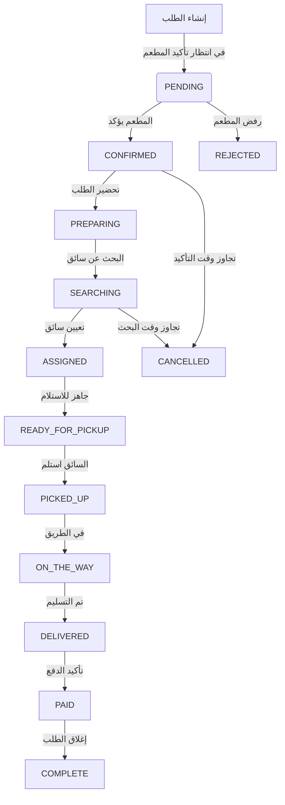

<div align="center">

# 🛵 نظام جيب (Jeeb) - Backend

<p align="center">
  
</p>

**النظام البرمجي المتكامل لإدارة عمليات التوصيل، المحافظ المالية، وإدارة المطاعم**

[](https://nestjs.com)
[](https://www.postgresql.org)
[](https://redis.io)
[](LICENSE)

[العربية](#) | [English](#english-version)

---

</div>

## 📖 نظرة عامة

**نظام جيب (Jeeb API)** هو المحرك الخلفي (Backend) الشامل المبني باستخدام **NestJS**، المصمم خصيصاً لإدارة منظومة التوصيل الكاملة: من طلبات العملاء، إدارة المطاعم، تتبع السائقين، إلى النظام المالي المتكامل (محافظ، عمولات، ولاء).

### 🎯 المشكلة التي يحلها
قبل هذا النظام، كانت تواجه شركات التوصيل تحديات في:
- 📉 إدارة موزعي التوصيل وتتبع مواقعهم اللحظية
- ⚠️ صعوبة إدارة العمليات المالية (عمولات، رسوم توصيل، محافظ الموظفين)
- 🕐 بطء مزامنة حالات الطلبات بين العميل، المطعم، والسائق
- 💸 تعقيد أنظمة الولاء والخصومات

**الحل:** نظام مركزي مؤتمت بالكامل يربط بين تطبيق العميل، تطبيق السائق، لوحة تحكم المطاعم، ولوحة تحكم الإدارة في بيئة سحابية آمنة ومزامنة لحظية.

---

## ✨ المميزات الرئيسية

### 🛵 إدارة التوصيل الذكية
- دعم مكاتب التوصيل (Office Owners) لإدارة أساطيل السائقين
- تتبع لحظي لمواقع السائقين عبر Firebase RTDB
- خوارزمية تقييم السائقين (Driver Scoring) لتعيين أفضل سائق للطلب
- نظام حالات الطلبات المتكامل (10 حالات من الطلب حتى التسليم)

### 💰 النظام المالي والمحافظ
- نظام محفظة مالية لكل مستخدم (عملاء، سائقين، تجار)
- دعم 3 عملات متزامنة: ريال سعودي (SAR)، دولار (USD)، ليرة سورية (SYP)
- تدقيق مالي كامل (Ledger Pattern) لعمليات المحفظة
- نظام عمولات مرن (قابل للتخصيص لكل منتج/مطعم)

### 🛒 إدارة المطاعم والمنتجات
- دعم أنواع المطاعم (مطعم، متجر)
- إدارة المنتجات مع خصومات وكميات
- نظام كوبونات ذكي (نسب مئوية، مبالغ ثابتة، استهداف مخصص)
- تكامل مع مزودي خارجيين (UberEats، Talabat، etc.)

### 🔔 نظام الإشعارات متعدد القنوات
- دعم 4 قنوات إشعار: واتساب، بريد إلكتروني، SMS، Firebase (Push)
- إشعارات لحظية لحالات الطلبات، المدفوعات، والعروض
- نظام جدولة الإشعارات الجماعية

### ⭐ نظام الولاء (Loyalty System)
- كسب النقاط بعد كل عدد معين من الطلبات
- استبدال النقاط بخصومات أو رصيد محفظة
- انتهاء صلاحية النقاط بعد 6 أشهر من عدم النشاط

---

## 🛠️ البنية التقنية (Tech Stack)

### التقنيات الأساسية
| التقنية | الوصف |
| :--- | :--- |
| **NestJS** | إطار العمل الأساسي للنظام (Modular Architecture) |
| **PostgreSQL** | قاعدة البيانات العلائقية لتخزين البيانات الضخمة |
| **Redis** | للتخزين المؤقت، طوابير المهام (BullMQ)، وإدارة الجلسات |
| **Firebase Admin** | التتبع اللحظي (RTDB) والإشعارات الفورية (FCM) |
| **JWT** | تأمين الوصول وإدارة الجلسات |

### المكتبات الرئيسية
| الحزمة | الاستخدام |
| :--- | :--- |
| `typeorm` | التعامل مع قاعدة البيانات بـ Repository Pattern |
| `bcrypt` | تشفير كلمات المرور بشكل آمن |
| `bullmq` | إدارة طوابير المهام الخلفية |
| `sharp` | ضغط ومعالجة الصور وتحسين الأداء |
| `nodemailer` | إرسال البريد الإلكتروني |
| `wasenderapi` | إرسال إشعارات الواتساب |
| `openai` | تكامل الذكاء الاصطناعي (Blaze API) |
| `@nestjs/websockets` | التتبع اللحظي عبر Socket.io |

---

## 🏗️ الهيكل التنظيمي للمشروع

```text
src/
├── config/             # إعدادات النظام (TypeORM, Firebase, Redis)
├── common/            # مكونات مشتركة (Guards, Pipes, Strategies)
│   ├── guards/        # حراس المصادقة والصلاحيات
│   ├── pipes/         # معالجة البيانات الواردة
│   ├── strategies/     # استراتيجيات الدفع، الإشعارات، التتبع
│   └── enums/         # الثوابت والأنماط (Enums)
├── modules/            # الوحدات الوظيفية (Modular Architecture)
│   ├── auth/          # المصادقة، التسجيل، إدارة الجلسات
│   ├── orders/        # إدارة الطلبات (Pipeline Architecture)
│   ├── products/      # إدارة المنتجات والمطاعم
│   ├── wallet/        # المحافظ المالية (Ledger Pattern)
│   ├── delivery/      # إدارة السائقين ومكاتب التوصيل
│   ├── notifications/ # نظام الإشعارات متعدد القنوات
│   ├── loyalty/       # نظام الولاء والنقاط
│   ├── payment/       # بوابات الدفع (Strategy Pattern)
│   ├── location/      # التتبع الجغرافي والاستراتيجيات
│   ├── cart/          # سلة التسوق
│   ├── coupons/       # نظام الكوبونات والخصومات
│   ├── merchants/     # إدارة المطاعم والتجار
│   ├── users/         # إدارة المستخدمين
│   └── settings/      # إعدادات النظام الديناميكية
└── app.module.ts      # نقطة الدخول الرئيسية
```

---

## 📊 بنية قاعدة البيانات (Schema)

### الكيانات الأساسية (Core Entities)
- **`users`**: جميع مستخدمي النظام (عملاء، سائقين، تجار، إدارة) مع دعم الأدوار المتعددة
- **`orders`**: سجل الطلبات الكامل مع الحالات المالية واللوجستية
- **`wallets`**: المحافظ المالية لكل مستخدم مع رصيد متعدد العملات
- **`wallet_transactions`**: سجل العمليات المالية (Ledger) لضمان التدقيق الكامل
- **`merchants`**: بيانات المطاعم والتجار مع أنواع (مطعم، متجر)
- **`products`**: المنتجات مع دعم المزودين الخارجيين والعمولات
- **`delivery_assignments`**: تعيين السائقين للطلبات مع حالات التوصيل
- **`notification_logs`**: سجل الإشعارات المرسلة مع حالات التسليم

### العلاقات الرئيسية
- **User ↔ Wallet**: One-to-One (كل مستخدم يملك محفظة واحدة)
- **User ↔ Order**: One-to-Many (المستخدم يمكنه طلب عدة طلبات)
- **Merchant ↔ Product**: One-to-Many (المطعم يقدم عدة منتجات)
- **Order ↔ OrderItem**: One-to-Many (الطلب يحتوي على عدة منتجات)
- **Order ↔ DeliveryAssignment**: One-to-One (الطلب يُعين لسائق واحد)

---

## 🔄 آليات العمل العميقة (Deep Mechanics)

### 📦 دورة حياة الطلب (Order Lifecycle)


### 💰 نظام المحفظة المالية (Wallet System)
يعتمد النظام على **Ledger Pattern** لضمان دقة العمليات المالية:
1. **العمليات**: إما إضافة (CREDIT) أو خصم (DEBIT)
2. **الأسباب**: (دفع طلب، رسوم توصيل، إكرامية، جزاء، إيداع، سحب، استرداد)
3. **التدقيق**: تسجيل الرصيد بعد كل عملية لضمان عدم وجود تضارب
4. **تعدد العملات**: دعم SAR، USD، SYP مع تثبيت سعر الصرف عند الطلب

### 💳 أنظمة الدفع (Payment Strategies)
يستخدم النظام **Strategy Pattern** لدعم بوابات دفع متعددة:
- **نقداً (CASH)**: عند الاستلام مع رفع إيصال الدفع
- **محفظة (WALLET)**: خصم من رصيد المستخدم
- **بوابات إلكترونية**: Stripe، Syriatel Cash، MTN Cash، USDT، PayPal
- تكامل مع BullMQ لمعالجة المدفوعات في الخلفية

### 🔔 نظام الإشعارات (Notification System)
- **القنوات**: واتساب (WasenderAPI)، بريد إلكتروني (Nodemailer)، Firebase (FCM)، SMS
- **الأنواع**: OTP، حالات الطلبات، عروض، كوبونات، تنبيهات إدارية
- **المواضيع**: إرسال جماعي لجميع المستخدمين، السائقين، المطاعم

---

## 🎟️ نظام الكوبونات والخصومات (Coupons & Discounts)

يدعم النظام محرك خصومات مرن:
- **أنواع الخصومات**: نسبة مئوية، مبلغ ثابت
- **الاستهداف**: كوبونات عامة، مخصصة لمستخدمين معينين، أو منتجات محددة
- **القيود**: حد أدنى للشراء، حد أقصى للخصم، فترة صلاحية، حد استخدام

---

## 🏛️ الهيكلية المعمارية وإصدارات الـ API (Architecture)

يعتمد النظام على بنية **Modular Monolith** تضمن سهولة التوسع والصيانة:

### 1. إصدارات الـ API (Versioning)
- جميع الـ Endpoints تتبع البادئة `/api/v1/` لضمان توافق التطبيقات
- فصل كامل بين وحدات النظام لسهولة التحديث المستقل

### 2. الأنماط المعمارية (Design Patterns)
- **Pipeline Pattern**: في معالجة الطلبات (Validation → Authorization → Stock Check → Notification)
- **Strategy Pattern**: في الدفع، الإشعارات، وحساب المسافات
- **Ledger Pattern**: في العمليات المالية للمحافظ
- **Repository Pattern**: في التعامل مع قاعدة البيانات عبر TypeORM

### 3. المصادقة والصلاحيات (RBAC)
- **الأدوار**: ADMIN، CUSTOMER، DELIVERY، MERCHANT، OFFICE_OWNER، SUPPORT
- **الحراس (Guards)**: AuthGuard (JWT)، RolesGuard (الصلاحيات)، ThrottlerGuard (الحد من الطلبات)
- **مدة التوكن**: تختلف حسب الدور (العملاء 30 يوم، السائقين 7 أيام، الإدارة 1 يوم)

---

## 🔐 نظام المصادقة والأمان (Authentication & Security)

### أنواع تسجيل الدخول
- **العملاء والتجار والإدارة**: دخول عبر البريد الإلكتروني وكلمة المرور
- **السائقين**: توكن مخصص لـ Firebase (uid: `delivery_{userId}`)
- **الزوار**: حسابات مؤقتة (تُحذف تلقائياً بعد 5 أيام من عدم النشاط)

### إدارة الجلسات (JWT Management)
- توكنات JWT مع مدة صلاحية تختلف حسب الدور
- دعم إلغاء التوكنات (Token Revocation) عبر Redis و سجل التوكنات
- حظر المحاولات المتكررة للدخول (Login Attempt Blocking) مع زيادة مدة الحظر تدريجياً

### حماية النظام
- **Helmet**: رؤوس أمان لحماية من هجمات الويب
- **Throttler**: تحديد عدد الطلبات (50 طلب/دقيقة لـ GET، 30 لباقي الطرق)
- **bcrypt**: تشفير كلمات المرور بـ 10 rounds من الملح

---

## 🕒 إدارة المهام المجدولة (Cron Jobs)

يعتمد النظام على `@nestjs/schedule` و `BullMQ` لتنفيذ مهام دورية مؤتمتة:

### 1. تنظيف الحسابات الزائرة (Guest Cleanup)
- **التكرار**: كل يوم الساعة 3:00 صباحاً
- **الإجراء**: حذف حسابات الزوار التي لم تسجل دخولها منذ 5 أيام ولم تطلب شيئاً

### 2. تنظيف سجلات الإشعارات
- **التكرار**: كل يوم عند منتصف الليل
- **الإجراء**: حذف سجلات OTP الأقدم من 24 ساعة

### 3. التحقق من مهلة الطلبات
- **التكرار**: كل 5 دقائق
- **الإجراء**: إلغاء الطلبات التي تجاوزت 120 دقيقة في حالة (CONFIRMED) أو (SEARCHING)

### 4. طوابير المهام (BullMQ)
- معالجة الإشعارات الجماعية في الخلفية
- معالجة عمليات الدفع المعقدة
- تحديث بيانات المزودين الخارجيين

---

## 🤖 تكامل الذكاء الاصطناعي (Blaze API)

يستخدم النظام **Blaze API** المتوافق مع OpenAI لدعم:
- ردود تلقائية لخدمة العملاء
- توصيات المنتجات الذكية
- تحليل بيانات الطلبات والاتجاهات
- مكالمات الأدوات (Function Calling) لأتمتة المهام

---

## 🚀 التشغيل والإدارة (Quick Start)

### المتطلبات الأساسية
- Node.js (v18+)
- Docker & Docker Compose (لتشغيل PostgreSQL و Redis)
- PostgreSQL (v15+) - اختياري إذا تم استخدام Docker
- Redis (v7+) - اختياري إذا تم استخدام Docker

### خطوات التثبيت
1. استنساخ المستودع:
```bash
git clone https://github.com/assem2023-habib/Jeeb_NestJs.git
cd delivery-jeeb
```

2. تثبيت الحزم:
```bash
npm install
```

3. إعداد ملف البيئة:
```bash
cp .env.example .env
# قم بتعديل القيم في .env حسب إعداداتك
```

4. تشغيل قاعدة البيانات و Redis عبر Docker:
```bash
docker-compose up -d
```

5. تشغيل النظام:
```bash
# وضع التطوير
npm run start:dev

# وضع الإنتاج
npm run build
npm run start:prod
```

### المراقبة (Production)
نستخدم **PM2** لضمان استمرارية العمل:
```bash
pm2 start dist/main.js --name jeeb-api
pm2 logs jeeb-api
```

---

## ⚙️ إعدادات النظام (Environment Variables)

مثال لملف `.env`:
```env
# قاعدة البيانات
DB_HOST=localhost
DB_PORT=5432
DB_USERNAME=postgres
DB_PASSWORD=your_password
DB_DATABASE=jeeb_db

# JWT
JWT_SECRET=your_super_secret_key
JWT_EXPIRATION_CUSTOMER=30d
JWT_EXPIRATION_DELIVERY=7d
JWT_EXPIRATION_MERCHANT=7d
JWT_EXPIRATION_ADMIN=1d

# Firebase
FIREBASE_PROJECT_ID=your_project_id
FIREBASE_PRIVATE_KEY="your_private_key"
FIREBASE_CLIENT_EMAIL=your_client_email@your_project.iam.gserviceaccount.com
FIREBASE_DATABASE_URL=https://your_project.firebaseio.com

# الإشعارات
WASENDER_API_KEY=your_wasender_api_key
SMTP_HOST=smtp.gmail.com
SMTP_PORT=587
SMTP_USER=your_email@gmail.com
SMTP_PASS=your_email_password
EMAIL_FROM=no-reply@jeeb.com

# Redis
REDIS_HOST=localhost
REDIS_PORT=6379
REDIS_PASSWORD=your_redis_password

# Google Maps
GOOGLE_DIRECTIONS_API_KEY=your_google_api_key

# Blaze API (AI)
BLAZE_API_KEY=your_blaze_api_key
BLAZE_BASE_URL=https://api.blaze.ai
```

---

## 👨‍💻 المطور والترخيص
- **المطور:** فريق تطوير شركة جيب (Jeeb Team)
- **الترخيص:** ملكية خاصة (Private) - جميع الحقوق محفوظة © 2026.

---

<div id="english-version"></div>

# 🛵 Jeeb Delivery & Wallet Backend (English)

**Comprehensive Delivery, Wallet, and Merchant Management System**

### Overview
Jeeb API is a robust NestJS-based backend that powers a complete delivery ecosystem, including real-time driver tracking, financial wallets, multi-currency support, and AI integration.

### Key Features
- **Modular Monolith** architecture for scalability
- **Real-time tracking** via Firebase RTDB
- **Multi-currency wallet** system with ledger auditing
- **Strategy Pattern** for payments, notifications, and distance calculation
- **Loyalty system** with point expiration
- **AI integration** via Blaze API (OpenAI-compatible)

### Tech Stack
- **Framework:** NestJS v11, TypeScript
- **Database:** PostgreSQL, TypeORM
- **Caching/Queues:** Redis, BullMQ
- **Real-time:** Firebase Admin, Socket.io
- **Payments:** Stripe, Syriatel Cash, MTN Cash, USDT
- **Notifications:** WhatsApp (WasenderAPI), Email (Nodemailer), FCM

---

<div align="center">
**صُنع بـ ❤️ لشركة جيب**
</div>
