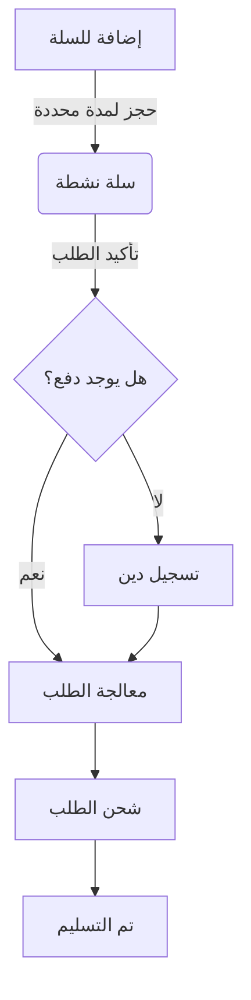

<div align="center">

# 👑 نظام شهرزاد (Shehrezad API) - Backend

<p align="center">
  
</p>

**النظام البرمجي المتكامل لإدارة مبيعات وطلبات شركة شهرزاد**

[](https://nodejs.org)
[](https://expressjs.com)
[](https://www.mysql.com)
[](LICENSE)

[العربية](#) | [English](#english-version)

---

</div>

## 📖 نظرة عامة

**نظام شهرزاد (Shehrezad API)** هو المحرك الخلفي (Backend) المتطور المصمم خصيصاً لإدارة العمليات التجارية لشركة "شهرزاد". يوفر النظام بنية تحتية قوية لإدارة المنتجات، السلال، الطلبات، والديون المالية، مع دعم كامل لتعدد العملات والإشعارات الفورية.

### 🎯 المشكلة التي يحلها

قبل هذا النظام، كانت إدارة الطلبات والديون والمنتجات المتغيرة (ألوان ومقاسات) تتطلب:
- 📉 جهد يدوي كبير في تتبع المخزون لكل لون ومقاس.
- ⚠️ أخطاء في احتساب الديون مع تقلبات أسعار الصرف (USD, TRY, SYP).
- 🕐 بطء في التواصل مع الزبائن بشأن حالات الطلب.

**الحل:** نظام مركزي مؤتمت بالكامل يربط بين تطبيق الزبون، تطبيق الموظف، ولوحة تحكم المدير في بيئة سحابية آمنة ومزامنة لحظياً.

---

## ✨ المميزات الرئيسية

### 🛍️ إدارة المنتجات الذكية
- دعم المنتجات ذات المتغيرات (ألوان، صور مخصصة لكل لون، ومقاسات).
- إدارة دقيقة للمخزون على مستوى المقاس (Size-level inventory).
- معالجة آلية للصور وتحسين أحجامها باستخدام `Sharp`.

### 💰 النظام المالي وتعدد العملات
- دعم 3 عملات متزامنة: دولار (USD)، ليرة تركية (TRY)، ليرة سورية (SYP).
- تحديث لحظي لأسعار الصرف وتثبيتها عند إتمام الطلب.
- نظام ديون متكامل يربط الدفعات بالطلبات أو يسجلها كديون عامة.

### 🛒 السلة الذكية والحجز (Locking)
- حجز المنتجات تلقائياً عند إضافتها للسلة لمنع نفاذ المخزون أثناء التفكير.
- مؤقت زمني لإلغاء الحجز وإعادة القطع للمخزون في حال عدم الإتمام.
- دعم الكوبونات والخصومات (مبلغ ثابت أو نسبة مئوية).

### 📄 الفواتير والتقارير
- توليد تلقائي للفواتير بصيغة PDF بدقة عالية باستخدام `Puppeteer`.
- تقارير مبيعات وإحصائيات مفصلة للمديرين.

---

## 🛠️ البنية التقنية (Tech Stack)

### التقنيات الأساسية
| التقنية | الوصف |
| :--- | :--- |
| **Node.js** | بيئة التشغيل الأساسية للسيرفر |
| **Express.js** | إطار عمل الويب والـ Routing |
| **MySQL** | قاعدة البيانات العلائقية لتخزين البيانات الضخمة |
| **JWT** | تأمين الوصول وإدارة الجلسات |
| **Firebase Admin** | نظام الإشعارات الفورية (Push Notifications) |

### المكتبات الرئيسية
| الحزمة | الاستخدام |
| :--- | :--- |
| `mysql-promise` | التعامل مع قاعدة البيانات بـ Async/Await |
| `bcrypt` | تشفير كلمات المرور بشكل آمن |
| `multer` | معالجة رفع ملفات الصور |
| `sharp` | ضغط ومعالجة الصور وتحسين الأداء |
| `puppeteer` | تحويل HTML إلى PDF للفواتير |
| `node-cron` | جدولة المهام المؤتمتة (تنظيف السلال) |

---

## 🏗 الهيكل التنظيمي للمشروع

```text
src/
├── config/             # إعدادات (DB, Firebase, Cloudinary)
├── middleware/         # التأكد من (Token, Roles, Uploads)
├── utils/              # دوال مساعدة (Currency, Date, Image)
├── modules/            # الوحدات الوظيفية (Modular Architecture)
│   ├── customer/       # واجهات تطبيق الزبون
│   │   ├── cart/       # العملات، الحجز، الكوبونات
│   │   ├── debts/      # الديون، الدفعات، الملاحظات
│   │   └── products/   # عرض المنتجات، المراجعات
│   ├── employee/       # واجهات تطبيق الموظف (الجرد، الطلبات)
│   └── dashboard/      # لوحة التحكم (الإحصائيات، الإعدادات)
└── app.js              # نقطة الدخول الرئيسية
```

---

## 📊 بنية قاعدة البيانات (Schema)

### 1. إدارة المخزون (Inventory Hierarchy)
- **`products`**: البيانات الأساسية والأسعار.
- **`product_colors`**: الألوان والصور المرتبطة بكل لون.
- **`product_sizes`**: المخزون الحقيقي (كل مقاس يتبع للون معين).

### 2. السلال والطلبات (Order Flow)
- **`carts`**: السلال النشطة، حالاتها، وطرق الشحن.
- **`cart_items`**: القطع المحجوزة (`is_locked`).
- **`orders`**: السجل النهائي للطلب، العملة المستخدمة، والخصومات.
- **`invoices`**: الفواتير الصادرة برقم فاتورة فريد.

---

## � نظام السلال والتحويل للطلبات (Carts & Order Conversion)

يعتبر نظام السلال في شهرزاد من أكثر الأجزاء تعقيداً ودقة، حيث يضمن تجربة تسوق عادلة للزبائن وحماية لمخزون الشركة.

### 1. دورة حياة السلة (Cart Lifecycle)
- **الإضافة للسلة**: عند إضافة منتج، يتم التحقق من المخزون (`product_sizes.stock`). إذا توفر، يتم إنقاص المخزون فوراً وحجز القطعة (`is_locked = 1`) في جدول `cart_items`.
- **مؤقت الحجز (TTL)**: يتم تشغيل مهام مجدولة (**Cron Jobs**) كل ساعة للبحث عن السلال المهجورة (التي تجاوزت 24 ساعة) وإعادة محتوياتها للمخزون تلقائياً.
- **تأكيد الطلب (Checkout)**: يتم عبر دالة `confirmCartByCode` في لوحة التحكم، والتي تقوم بسلسلة من العمليات التراسلية (Transactional):
    1. التحقق من كود السلة وصلاحيتها.
    2. تحويل بيانات السلة إلى سجل جديد في `orders`.
    3. توليد رقم فاتورة فريد (`invoice_number`).
    4. تثبيت أسعار الصرف الحالية في الطلب.
    5. مسح محتويات السلة وإغلاقها (`status = 'completed'`).

### 2. معالجة الطلبات غير المدفوعة والديون (Unpaid Orders Logic)
النظام مصمم ليدعم المرونة في الدفع، حيث يمكن للطلب أن يكون:
- **مدفوع بالكامل**: يتم تسجيل الدفعة وإغلاق الفاتورة.
- **مدفوع جزئياً أو غير مدفوع**: هنا يتدخل نظام الديون الآلي:
    - **خلق الدين**: إذا كان `final_total > paid_amount` في دالة `confirmCartByCode` أو `payOrders` في الموظف، يتم استدعاء `debtsService.addDebt`.
    - **الربط بالطلب**: يتم إنشاء سجل في `customer_debts` يربط المبلغ المتبقي بالـ `order_id` الخاص بالطلب.
    - **تحديث الرصيد**: يتم تحديث الحقل `remaining` في جدول الديون بشكل تراكمي.
    - **الإشعارات**: يُرسل إشعار فوري للزبون بتسجيل دين جديد على حسابه.

---

## � نظام الديون والعملات (Debts & Multi-Currency System)

يعتمد نظام شهرزاد على بنية مالية مرنة تسمح بتعدد العملات وتتبع دقيق للمديونية لكل زبون.

### 1. تمثيل القيم المالية (Financial Representation)
يتم تخزين المبالغ المالية في النظام بدقة عالية (`DECIMAL(10, 2)`) لضمان عدم حدوث أخطاء تقريب. يدعم النظام ثلاث عملات رئيسية:
- **الدولار الأمريكي (USD)**
- **الليرة التركية (TRY)**
- **الليرة السورية (SYP)**

يتم تسجيل كل "دين" بالعملة التي تم بها الطلب، ويحتفظ النظام بسجل منفصل لكل عملة لضمان استقرار القيمة المالية للشركة والزبون.

### 2. آلية عمل الديون (Debt Workflow)
تنشأ الديون في النظام عبر مسارين:
- **تلقائياً**: عند تأكيد طلب (Checkout) بمبلغ مدفوع أقل من إجمالي الفاتورة.
- **يدوياً**: عبر لوحة التحكم من خلال "تسوية رصيد" أو تسجيل مبالغ دائنة/مدينة إضافية.

**خصائص سجل الدين:**
- **`amount`**: المبلغ الأصلي للدين.
- **`paid_amount`**: إجمالي ما تم دفعه لهذا الدين تحديداً.
- **`remaining`**: المبلغ المتبقي المستحق.
- **`status`**: حالة الدين (`pending`: لم يدفع، `partial`: مدفوع جزئياً، `paid`: مدفوع بالكامل).

### 3. التوزيع الذكي للدفعات (FIFO Payment Allocation)
عندما يقوم الزبون بتسديد دفعة مالية عامة على حسابه، يتبع النظام خوارزمية **FIFO (First In, First Out)**:
1. يتم البحث عن أقدم الديون غير المدفوعة لنفس العملة.
2. يتم خصم المبلغ من الدين الأقدم، وإذا زاد مبلغ الدفعة ينتقل آلياً للدين الذي يليه.
3. في حال وجود "فائض دفع" (مبلغ أكبر من مجموع الديون)، يتم تسجيله كـ **مبلغ دائن** للزبون ليُخصم تلقائياً من طلباته القادمة.

---

## 🏛️ الهيكلية المعمارية وإصدارات الـ API (Architecture & Versioning)

يعتمد النظام على بنية برمجية منظمة تضمن سهولة التوسع والصيانة وتوافق الإصدارات.

### 1. إصدارات الـ API (Versioning)
يتبع النظام استراتيجية الإصدارات في الـ URL لضمان عدم توقف التطبيقات القديمة عند تحديث الـ Backend:
- **تطبيق الزبون (Customer App)**: يستخدم البادئة `/v3/customer/` (مثال: `{{baseUrl}}/v3/customer/products`).
- **لوحة التحكم (Dashboard/Employee)**: يستخدم البادئة `/v2/dashboard/` (مثال: `{{baseUrl}}/v2/dashboard/orders`).

هذا الفصل يسمح لنا بتطوير ميزات جذرية في تطبيق الزبون دون التأثير على استقرار لوحة تحكم الموظفين.

### 2. النمط المعماري (Modular Architecture)
تم تصميم المشروع وفق نمط **البرمجة التركيبية (Modular Architecture)**، حيث يتم تقسيم النظام إلى وحدات مستقلة بناءً على الوظيفة (Domain-Driven Design مبسط):

- **طبقة المسارات (Routes)**: مسؤولة عن استقبال الطلبات وتحديد الـ Endpoints.
- **طبقة المتحكمات (Controllers)**: مسؤولة عن معالجة الطلبات، التحقق من البيانات المدخلة، وإرسال الردود.
- **طبقة الخدمات (Services)**: تحتوي على "منطق العمل" (Business Logic) والتعامل مع قاعدة البيانات، وهي الطبقة التي يتم إعادة استخدامها في أكثر من مكان.
- **طبقة الإعدادات (Config)**: تشمل إعدادات قاعدة البيانات، Firebase، والمهام المجدولة.

**لماذا هذا النمط؟**
*   **سهولة الصيانة**: إذا حدث خطأ في "الديون"، نعرف تماماً أن المشكلة في `modules/customer/debts`.
*   **قابلية التوسع**: يمكن إضافة وحدة جديدة (مثلاً: `modules/marketing`) دون المساس بالأكواد الحالية.
*   **إعادة الاستخدام**: يمكن استدعاء خدمات من موديول "الديون" داخل موديول "الطلبات" بسهولة.

---

## 🎟️ نظام الكوبونات والخصومات (Coupons & Discounts System)

يوفر نظام شهرزاد محركاً مرناً وقوياً لإدارة الكوبونات، يسمح بتخصيص العروض بدقة عالية لتحقيق أهداف تسويقية متنوعة.

### 1. أنواع الخصومات (Discount Types)
يدعم النظام نوعين رئيسيين من الخصم:
- **خصم نسبة مئوية (Percentage)**: خصم جزء من قيمة المنتج أو الطلب (مثلاً: 10%).
- **خصم مبلغ ثابت (Fixed)**: خصم مبلغ محدد من العملة (مثلاً: 50 ليرة تركية).

### 2. مستويات التخصيص (Targeting & Restrictions)
يتميز النظام بقدرته على تقييد استخدام الكوبونات بناءً على عدة معايير:
- **الجمهور المستهدف (Target Audience)**:
    - `all`: متاح لكافة الزبائن.
    - `specific_users`: متاح فقط لقائمة محددة من المستخدمين (مثلاً: كوبون ترحيبي لزبائن جدد).
- **المنتجات المستهدفة (Product Targeting)**:
    - `all`: يطبق على أي منتج في السلة.
    - `specific_products`: يطبق فقط على أصناف محددة (يستخدم لترويج بضاعة معينة).
- **القيود المالية والزمنية**:
    - **الحد الأدنى للشراء**: لا يمكن استخدام الكوبون إذا كانت قيمة السلة أقل من مبلغ معين.
    - **الحد الأقصى للخصم**: يضع سقفاً لمبلغ الخصم في حال النسبة المئوية.
    - **فترة الصلاحية**: تاريخ بداية ونهاية محدد بدقة.
    - **حد الاستخدام (Usage Limit)**: عدد المرات الإجمالي المسموح باستخدام الكوبون فيها (مثلاً: لأول 100 مستخدم فقط).

### 3. آلية التحقق والتطبيق (Validation Logic)
عند إدخال الكوبون، يقوم النظام بسلسلة من الفحوصات الصارمة:
1. التحقق من وجود الكوبون وحالته (`active`).
2. التأكد من أن الوقت الحالي يقع ضمن فترة الصلاحية.
3. التحقق من عدم تجاوز حد الاستخدام الإجمالي.
4. التأكد من أحقية المستخدم الحالي (إذا كان الكوبون مخصصاً).
5. التحقق من وجود المنتجات المستهدفة في السلة (إذا كان الكوبون للمنتجات).
6. التأكد من تحقيق الحد الأدنى لقيمة المشتريات.

### 4. تكامل الكوبونات مع السلة والطلب
يتم تخزين الكوبونات المطبقة في جدول وسيط `cart_applied_coupons` لضمان بقائها نشطة طالما السلة نشطة. عند تحويل السلة إلى طلب، يتم تثبيت قيمة الخصم في سجل الطلب لضمان مرجعية مالية ثابتة.

---

## ❤️ نظام المفضلة (Favorites System)

يوفر النظام ميزة "المفضلة" لتعزيز تجربة المستخدم ومساعدته في العودة للمنتجات التي نالت إعجابه لاحقاً.

### 1. آلية العمل (Favorites Logic)
- **الإضافة والإزالة الذكية (Toggle)**: يوفر النظام نقطة نهاية (`Endpoint`) واحدة تقوم بتبديل حالة المنتج (إضافة إذا لم يكن موجوداً، أو إزالة إذا كان موجوداً)، مما يسهل العمل على مطوري التطبيقات.
- **الارتباط بالمستخدم**: يتم ربط كل منتج مفضل بـ `user_id` الخاص بالزبون، مما يضمن مزامنة المفضلة عبر جميع أجهزة الزبون عند تسجيل الدخول.

### 2. الذكاء في العرض (Smart Filtering)
عندما يطلب الزبون قائمة المفضلة، يقوم النظام بإجراء عمليات تحقق لحظية:
- **تصفية المنتجات المحذوفة**: لا تظهر المنتجات التي قام المسؤول بحذفها نهائياً.
- **تصفية المخزون (Inventory Awareness)**:
    - يتم التحقق من توفر المنتج في المخزون (مجموع كميات كافة المقاسات والألوان).
    - إذا كان المنتج نافذاً من المخزون (`Out of Stock`) وكان النظام مضبوطاً على سياسة "إخفاء المنتجات النافذة"، فإنه يختفي تلقائياً من قائمة المفضلة حتى يتوفر مجدداً، مما يحافظ على نظافة القائمة واقتصارها على ما يمكن شراؤه فعلياً.

### 3. الأداء (Performance)
- يتم جلب الصورة الأساسية للمنتج (`main_image`) وبناء الرابط الكامل لها تلقائياً عند طلب القائمة.
- استخدام `UNIQUE KEY` في قاعدة البيانات يضمن عدم تكرار نفس المنتج في مفضلة المستخدم الواحد برمجياً وتقنياً.

---

## 🔄 آليات العمل العميقة (Deep Mechanics)

### 💰 منطق احتساب العملات
1. يتم تخزين أسعار الصرف في `settings`.
2. يتم عرض السعر للزبون بالعملة المختارة.
3. عند "تثبيت الطلب"، يتم حفظ سعر الصرف في سجل الطلب لضمان ثبات القيمة المالية حتى لو تغير الصرف لاحقاً.

### 📦 دورة حياة الطلب (Order Lifecycle)


---

## 🚀 التشغيل والإدارة

### المتطلبات الأساسية
- Node.js v14+
- MySQL Server 8.0+
- Firebase Project (للإشعارات)

### خطوات التثبيت
1. استنساخ المستودع: `git clone ...`
2. تثبيت الحزم: `npm install`
3. إعداد ملف `.env`:
   ```env
   DB_HOST=localhost
   DB_USER=root
   DB_PASS=your_password
   DB_NAME=shehrezad_db
   JWT_SECRET=your_secret
   ```
4. التشغيل: `npm start`

### المراقبة (Production)
نستخدم **PM2** لضمان استمرارية العمل:
- التشغيل: `pm2 start ecosystem.config.js`
- المراقبة: `pm2 logs shehrezad-api`

---

## 🔐 نظام المصادقة والأمان (Authentication & Security)

يعتمد النظام على بنية أمان متعددة الطبقات لضمان حماية بيانات المستخدمين وتحديد الصلاحيات بدقة:

### 1. أنواع تسجيل الدخول (Login Methods)
- **الزبائن (Customers)**:
  - يتم تسجيل الدخول عبر **كود العميل (Customer Code)** الفريد.
  - لا يحتاج الزبون لحفظ بريد إلكتروني أو كلمة مرور معقدة، الكود هو مفتاح الدخول.
  - يتم تحديث رمز الإشعارات (**FCM Token**) تلقائياً عند كل دخول لضمان وصول التنبيهات.
- **الموظفون والمديرون (Employees & Admins)**:
  - يتم الدخول عبر **البريد الإلكتروني وكلمة المرور**.
  - تخضع هذه الحسابات لسياسة أمان صارمة مع تشفير كلمات المرور باستخدام **Bcrypt** (Salt rounds: 10).

### 2. إنشاء الحسابات (Account Creation)
- **الأتمتة**: عند قيام المدير بإضافة زبون جديد، يقوم النظام تلقائياً بإنشاء سجل مستخدم وتخصيص كود فريد له.
- **الصلاحيات (RBAC)**: يتم توزيع الأدوار برمجياً (`customer`, `employee`, `admin`, `super_admin`) ولا يمكن لأي دور الوصول لمسارات دور آخر بفضل الـ Middleware المخصص (`authorizeRole`).

### 3. إدارة الجلسات (JWT Management)
- يتم إصدار **JSON Web Token** عند الدخول الناجح.
- **مدة الصلاحية**:
  - الزبائن: توكن طويل الأمد (10 سنوات) لتجنب الحاجة لتسجيل الدخول المتكرر في التطبيق.
  - الموظفون: توكن لمدة 24 ساعة فقط لزيادة الأمان.

---

## ☁️ التكامل مع Firebase ورفع الملفات (Firebase & Storage)

يعتبر **Firebase** الركيزة الأساسية لتخزين الملفات وإرسال التنبيهات:

### 1. تخزين الصور (Firebase Storage)
- **آلية الرفع**:
  1. يتم استلام الصورة عبر `Multer`.
  2. يتم تمرير الصورة لمكتبة `Sharp` لمعالجتها (تغيير الحجم لـ 800px، ضغط الجودة لـ 80%، وتحويلها لصيغة JPEG).
  3. تُرفع الصورة إلى Firebase Storage مع ضبط خاصية `public: true`.
  4. يُخزن **المسار النسبي** فقط في قاعدة البيانات (مثل: `products/image.jpg`) للحفاظ على مرونة النظام.
- **بناء الروابط**: يستخدم النظام دالة `constructFullUrl` لبناء الرابط الكامل عند الطلب، مما يسهل تغيير `Base URL` مستقبلاً دون تعديل قاعدة البيانات.

### 2. الإشعارات الفورية (FCM)
- يتم استخدام **Firebase Admin SDK** لإرسال إشعارات فورية للأجهزة عند:
  - تغيير حالة الطلب (قيد المعالجة، تم الشحن، تم التسليم).
  - إضافة ديون جديدة أو دفعات مالية.
  - الموافقة على تقييمات المنتجات.
  - عروض تسويقية عامة.

---

## ⭐ نظام التقييمات والمراجعات (Reviews System)

يسمح النظام للزبائن بمشاركة تجاربهم وتقييم المنتجات، مما يساعد في بناء الثقة وتحسين جودة المنتجات.

### 1. ميزات الزبون (Customer Features)
- **إضافة تقييم**: يمكن للزبون تقييم المنتج من 1 إلى 5 نجوم مع إضافة تعليق نصي.
- **التحقق من التكرار**: لا يسمح النظام للزبون بتقييم نفس المنتج أكثر من مرة واحدة.
- **إدارة التقييمات**: يمكن للزبون تعديل أو حذف تقييماته الخاصة في أي وقت.
- **الشفافية**: يظهر للزبون حالة تقييمه (معلق، مقبول، مرفوض).

### 2. ميزات الإدارة (Dashboard Features)
- **نظام المراجعة (Moderation)**: لا تظهر التقييمات للعامة إلا بعد موافقة المدير (`status = 'approved'`) لضمان خلوها من المحتوى غير اللائق.
- **الإحصائيات التحليلية**: 
    - حساب متوسط التقييم لكل منتج.
    - توزيع النجوم (كم عدد الذين قيموا بـ 5 نجوم، 4 نجوم، إلخ).
    - قائمة المنتجات الأعلى تقييماً لتوجيه قرارات الشراء والجرد.
- **الإجراءات الإدارية**: إمكانية الموافقة، الرفض، أو الحذف النهائي لأي تقييم.

---

## 🔄 آليات العمل العميقة (Deep Mechanics)

### 💰 منطق احتساب العملات
1. يتم تخزين أسعار الصرف في `settings`.
2. يتم عرض السعر للزبون بالعملة المختارة.
3. عند "تثبيت الطلب"، يتم حفظ سعر الصرف في سجل الطلب لضمان ثبات القيمة المالية حتى لو تغير الصرف لاحقاً.

### 📦 دورة حياة الطلب (Order Lifecycle)


---

## ⚙️ نظام الثوابت والـ ENUMs (Constants & Enums)

يعتمد النظام على هيكلية **ثوابت مركزية** لضمان توحيد البيانات وتجنب الأخطاء البرمجية الناتجة عن "القيم السحرية" (Magic Strings). يتم تعريف هذه القيم في ملفات `src/config/constants.js` و `src/config/notification_constants.js`.

### 1. تصنيف الصلاحيات والأدوار (User Roles)
- `CUSTOMER`: زبون التطبيق.
- `ADMIN` / `SUPER_ADMIN`: طاقم الإدارة.
- `ACCOUNTANT`: المحاسب المسؤول عن الديون والماليات.

### 2. دورة حياة السلال والطلبات (Status Enums)
- **حالات السلة (`CART_STATUS`)**: 
  - `ACTIVE`: سلة قيد التسوق.
  - `PAYMENT_CONFIRMATION`: بانتظار تأكيد الدفع (للحوالات).
  - `LATE`: سلة متأخرة تجاوزت وقت الحجز.
- **حالات الطلب (`ORDER_STATUS`)**:
  - `UNPAID` / `PAID`: الحالة المالية.
  - `PROCESSING` / `SHIPPED` / `COMPLETED`: الحالة اللوجستية.

### 3. إعدادات النظام الديناميكية (`SETTING_KEYS`)
يتم تخزين مفاتيح الإعدادات كثوابت لسهولة جلبها من قاعدة البيانات، مثل:
- `ITEM_LOCK_MINUTES`: مدة حجز المنتج في السلة قبل انتهاء الصلاحية.
- `MAX_CART_ITEMS`: الحد الأقصى للمنتجات في السلة الواحدة.

### 3. نظام الديون والمحاسبة (Debt & Payment System)
يرتبط النظام المالي بشكل وثيق بحالة الطلبات والسلال:
- **تأكيد السلة (Cart Confirmation)**:
    - عند تأكيد سلة بواسطة المحاسب، يتم حساب "الرصيد السابق" للزبون.
    - إذا كان هناك مبلغ مدفوع، يتم خصمه من إجمالي السلة، والمتبقي يُسجل كـ **دين جديد** في جدول `customer_debts`.
- **الطلبات غير المدفوعة (`payOrders`)**:
    - يتيح النظام دفع مجموعة طلبات دفعة واحدة.
    - **منطق التوزيع**: يتم توزيع المبلغ المدفوع على الطلبات المختارة بالتسلسل (FIFO).
    - **توليد الديون**: إذا كان المبلغ المدفوع أقل من إجمالي الطلبات، يتم إنشاء سجلات دين لكل طلب بالمبلغ المتبقي.
    - **سداد الديون القديمة**: إذا كان هناك فائض بعد دفع الطلبات الحالية، يتم توجيهه تلقائياً لسداد أقدم الديون المتبقية بذمة الزبون.
    - **الرصيد الدائن**: أي مبلغ متبقي بعد سداد كل الديون يُسجل كـ "رصيد دائن" (قيمة سالبة في جدول الديون) ليُستخدم في الطلبات المستقبلية.
- **تعديل الطلبات**: عند تعديل إجمالي طلب موجود، يتم تحديث سجل الدين المرتبط به تلقائياً لضمان دقة المحاسبة.

---

## 🛠️ إدارة المهام المجدولة (Cron Jobs)

يعتمد النظام على مكتبة `node-cron` لتنفيذ مهام دورية مؤتمتة تضمن سلامة البيانات وتوافر المخزون. يتم تعريف هذه المهام في `src/config/cron_jobs.js`:

### 1. نظام حجز المخزون الذكي (`lockExpiredItems`)
- **التكرار**: يتم التنفيذ **كل دقيقة**.
- **المنطق البرمجي**:
    1. **الفحص**: يبحث النظام عن المنتجات المضافة للسلال النشطة والتي لم يتم قفلها بعد (`is_locked = 0`).
    2. **حساب الوقت**: إذا تجاوز المنتج مدة الحجز المسموحة (`ITEM_LOCK_MINUTES`):
        - **توفر المخزون**: إذا كان المنتج متوفراً، يتم خصمه فوراً من المخزون وتغيير حالة العنصر إلى `is_locked = 1`.
        - **نفاد المخزون**: إذا لم يعد المنتج متوفراً، يتم حذفه من سلة الزبون وإرسال إشعار فوري له يخبره بحذف المنتج لعدم توفر كمية.
    3. **الهدف**: ضمان عدم "تجميد" المخزون من قبل مستخدمين غير جديين، وإعطاء فرصة للمشترين الفعليين.

### 2. تنظيف السلال القديمة
- **الهدف**: أرشفة السلال التي مضى عليها وقت طويل (مثل 15 يوم) دون أي إجراء، لتخفيف العبء عن قاعدة البيانات.

### 3. تذكيرات الشحن والطلبات
- **المنطق**: إرسال تنبيهات تلقائية للموظفين أو الزبائن بخصوص الطلبات التي تحتاج إجراءً فورياً بناءً على إعدادات `SHIPPING_DAYS`.

---

## 📊 نظام الإحصائيات والتقارير (Dashboard Analytics)

يوفر موديول الإحصائيات رؤية شاملة لأداء النظام من خلال:
- **نظرة عامة (Overview)**: إجمالي المبيعات، عدد الطلبات النشطة، وإجمالي الديون المستحقة.
- **المنتجات الأكثر مبيعاً**: تتبع الأصناف الأكثر طلباً لتوجيه المخزون.
- **نشاط العملاء**: مراقبة أحدث التسجيلات والطلبات لضمان استجابة سريعة.

---

## 👨‍💻 المطور والترخيص
- **المطور:** فريق تطوير شركة شهرزاد.
- **الترخيص:** ملكية خاصة (Private) - جميع الحقوق محفوظة © 2026.

---

<div id="english-version"></div>

# 👑 Shehrezad API - Backend (English)

**Comprehensive Sales, Order, and Debt Management System**

### Overview
Shehrezad API is a robust backend built with **Node.js** and **Express**, serving as the core engine for Shehrezad's business operations. It handles complex inventory (variants), multi-currency transactions, and smart cart locking.

### Key Features
- **Multi-Currency:** Support for USD, TRY, and SYP with fixed rates per order.
- **Inventory Locking:** Automatically reserve items when added to cart to prevent overselling.
- **Modular Design:** Scalable architecture with separate modules for Customers, Employees, and Admins.
- **PDF Invoicing:** High-fidelity invoice generation using Puppeteer.

### Tech Stack
- **Engine:** Node.js, Express, MySQL.
- **Security:** JWT, Bcrypt.
- **Services:** Firebase (Notifications), Sharp (Image Processing).

---

<div align="center">
**صُنع بـ ❤️ لشركة شهرزاد**
</div>
